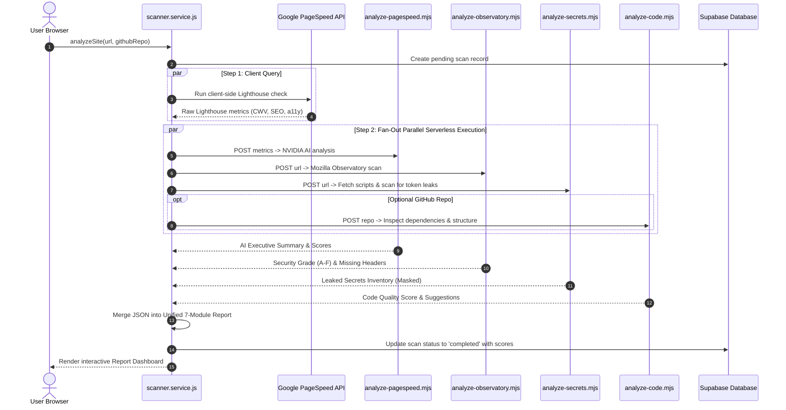
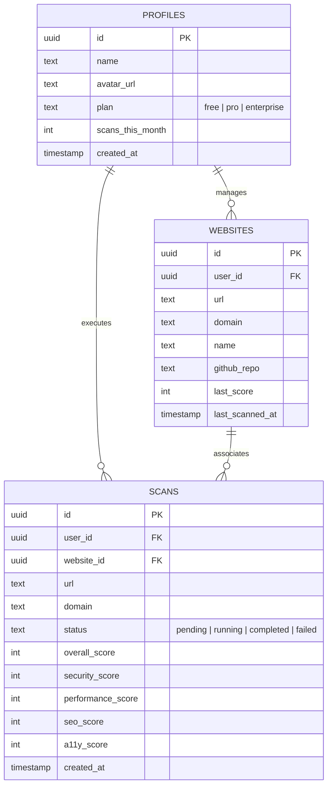
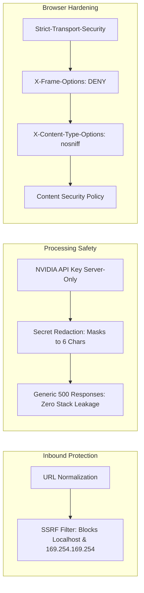

# 🏗️ SiteProof — System & Software Architecture

<div align="center">


**High-Throughput Parallel Audit Pipeline with Serverless AI Orchestration**

[](#)
[-00C7B7?style=for-the-badge&logo=netlify)](#)
[](#)
[](#)

</div>

---

## 1. 🌐 System Topology Overview

SiteProof separates concerns between an ultra-fast client-side React SPA, a secure serverless edge tier, and specialized third-party diagnostic and AI services:

```mermaid
graph TB
    subgraph Client Tier ["💻 Client Tier (Browser)"]
        UI["React 19 SPA (Vite + Tailwind CSS v4)"]
        Router["React Router 7 (Lazy Loaded Chunks)"]
        State["Context State (Auth, Theme, Toast)"]
        Cache["Browser Session & URL Cache"]
        UI --> Router
        UI --> State
        UI --> Cache
    end

    subgraph Edge Tier ["⚡ Netlify Serverless Edge Functions"]
        FN_MAIN["analyze.mjs (Main Orchestrator)"]
        FN_PS["analyze-pagespeed.mjs (PageSpeed AI)"]
        FN_OBS["analyze-observatory.mjs (Mozilla Security)"]
        FN_SEC["analyze-secrets.mjs (Bundle AST Scanner)"]
        FN_CODE["analyze-code.mjs (GitHub Inspector)"]
        Utils["Shared Utils (SSRF Protection, Auth, JSON parser)"]
        
        FN_MAIN --> Utils
        FN_PS --> Utils
        FN_OBS --> Utils
        FN_SEC --> Utils
        FN_CODE --> Utils
    end

    subgraph Data Tier ["🗄️ Cloud Data Tier (Supabase)"]
        SupaAuth["Supabase Auth (Google OAuth & JWT)"]
        SupaDB["PostgreSQL Database (RLS Enforced)"]
        T_Prof[("profiles")]
        T_Web[("websites")]
        T_Scan[("scans (Metadata Only)")]
        SupaDB --> T_Prof
        SupaDB --> T_Web
        SupaDB --> T_Scan
    end

    subgraph External Engines ["🔌 External Diagnostic & AI Services"]
        PageSpeed["Google PageSpeed Insights API"]
        Observatory["Mozilla Observatory API"]
        NvidiaNIM["NVIDIA NIM AI (DeepSeek / Llama 3)"]
        GitHubAPI["GitHub REST API"]
    end

    %% Interactions
    UI -->|1. Sign in & session| SupaAuth
    UI -->|2. Lightweight scan logs| SupaDB
    UI -->|3. Public Performance Scan| PageSpeed
    UI -->|4. Parallel Deep Analysis| Edge Tier

    FN_PS -->|PageSpeed metrics + AI synthesis| NvidiaNIM
    FN_OBS -->|HTTP Security Headers| Observatory
    FN_SEC -->|Script tags inspection| UI
    FN_CODE -->|Repo inspection| GitHubAPI
    FN_CODE -->|Code review prompts| NvidiaNIM
```

---

## 2. ⚡ The "Split-the-Brain" Parallel Audit Pipeline

> [!TIP]
> Traditional monolithic web audit engines can take 60–90 seconds and often hit cloud serverless execution timeouts (typically 10–26s on free tiers). SiteProof implements a **"Split-the-Brain" parallel architecture**:
> - Client handles the fast public PageSpeed query directly.
> - Client concurrently fans out sub-requests to isolated Netlify functions.
> - Total scan completion drops to **15–25 seconds**, completely eliminating serverless timeouts.



---

## 3. 🗺️ Frontend Route Architecture

The frontend is built with **React 19** and **React Router 7**, employing an auto-recovering lazy-loading mechanism ([`lazyWithRetry`](file:///c:/Users/Lenovo/Documents/vibe%20codding/src/App.jsx#L15)) that automatically recovers from stale Vite chunk hashes during rolling deployments:

| Route Path | Component File | Auth State | Purpose |
| :--- | :--- | :--- | :--- |
| `/` | [`LandingPage.jsx`](file:///c:/Users/Lenovo/Documents/vibe%20codding/src/pages/landing/LandingPage.jsx) | Public | High-converting hero, live URL scan bar, value propositions, FAQ |
| `/sample-report` | [`SampleReportPage.jsx`](file:///c:/Users/Lenovo/Documents/vibe%20codding/src/pages/report/SampleReportPage.jsx) | Public | Instant interactive demo report without needing a live URL |
| `/report/:reportId` | [`ReportPage.jsx`](file:///c:/Users/Lenovo/Documents/vibe%20codding/src/pages/report/ReportPage.jsx) | Public/Auth | Full 7-module audit dashboard, circular gauges, AI prompt copy tool |
| `/dashboard` | [`DashboardPage.jsx`](file:///c:/Users/Lenovo/Documents/vibe%20codding/src/pages/dashboard/DashboardPage.jsx) | Protected | User workspace, active monitored sites, recent scores |
| `/history` | [`HistoryPage.jsx`](file:///c:/Users/Lenovo/Documents/vibe%20codding/src/pages/history/HistoryPage.jsx) | Protected | Chronological archive of past audits with score trends |
| `/login` | [`LoginPage.jsx`](file:///c:/Users/Lenovo/Documents/vibe%20codding/src/pages/auth/LoginPage.jsx) | Guest | Google OAuth & Email/password login |
| `/signup` | [`SignupPage.jsx`](file:///c:/Users/Lenovo/Documents/vibe%20codding/src/pages/auth/SignupPage.jsx) | Guest | User registration with email verification |
| `/forgot-password` | [`ForgotPasswordPage.jsx`](file:///c:/Users/Lenovo/Documents/vibe%20codding/src/pages/auth/ForgotPasswordPage.jsx) | Guest | Password reset request form |
| `/reset-password` | [`ResetPasswordPage.jsx`](file:///c:/Users/Lenovo/Documents/vibe%20codding/src/pages/auth/ResetPasswordPage.jsx) | Guest | Set new password with Supabase token |
| `/auth/callback` | [`AuthCallback.jsx`](file:///c:/Users/Lenovo/Documents/vibe%20codding/src/pages/auth/AuthCallback.jsx) | Public | OAuth exchange handler for Google redirects |
| `/about` | [`AboutPage.jsx`](file:///c:/Users/Lenovo/Documents/vibe%20codding/src/pages/about/AboutPage.jsx) | Public | Product background, philosophy, and team mission |
| `/contact` | [`ContactPage.jsx`](file:///c:/Users/Lenovo/Documents/vibe%20codding/src/pages/contact/ContactPage.jsx) | Public | Support form and inquiry routing |
| `/404` | [`NotFoundPage.jsx`](file:///c:/Users/Lenovo/Documents/vibe%20codding/src/pages/errors/NotFoundPage.jsx) | Public | Graceful error state with return CTA |

---

## 4. ⚡ Serverless Functions Specification

All sensitive logic, third-party tokens, and AI calls are isolated in `netlify/functions/`:

```
netlify/functions/
├── analyze.mjs              # Main fallback entry point
├── analyze-pagespeed.mjs    # Passes Lighthouse data to NVIDIA DeepSeek AI
├── analyze-observatory.mjs  # Calls Mozilla Observatory API for HTTP security
├── analyze-secrets.mjs      # Fetches client scripts & scans 25+ secret regexes
├── analyze-code.mjs         # Fetches GitHub repo structure & evaluates code
└── utils/
    ├── auth.mjs             # Supabase JWT token verification
    ├── cors.mjs             # CORS origin validation & options handling
    ├── json.mjs             # Robust JSON response sanitization
    ├── ssrf.mjs             # IP / hostname whitelist & SSRF blocking
    └── supabase.mjs         # Serverless Supabase admin client
```

---

## 5. 🗄️ Database & Storage Strategy

> [!NOTE]
> **Minimal Storage Pattern (~300 bytes per scan)**
> To keep Supabase operating comfortably within free tier limits, SiteProof intentionally avoids saving large, bloated raw JSON trees or HTML snapshots to the database. Only core metadata (scores, timestamps, domain, user ID) is persisted in the [`scans`](file:///c:/Users/Lenovo/Documents/vibe%20codding/database/supabase_migration.sql#L52) table. Full diagnostic reports are cached in the browser's session storage and regenerated on-demand.



---

## 6. 🛡️ Security & Defensive Architecture

SiteProof enforces multi-tiered defensive mechanisms across both the client and serverless boundaries:



* **SSRF Mitigation**: URLs entered for scanning are strictly vetted against private and metadata IP ranges (`127.0.0.1`, `10.0.0.0/8`, `192.168.0.0/16`, `169.254.169.254`).
* **Secret Redaction**: When client tokens are detected, the response caps visible characters at 6 characters (`ghp_3a9f••••••••`) to prevent echoing live secrets to viewers.
* **HTTP Security Headers**: Defined in [`netlify.toml`](file:///c:/Users/Lenovo/Documents/vibe%20codding/netlify.toml#L31-L40), ensuring A+ grades for the SiteProof application itself.
