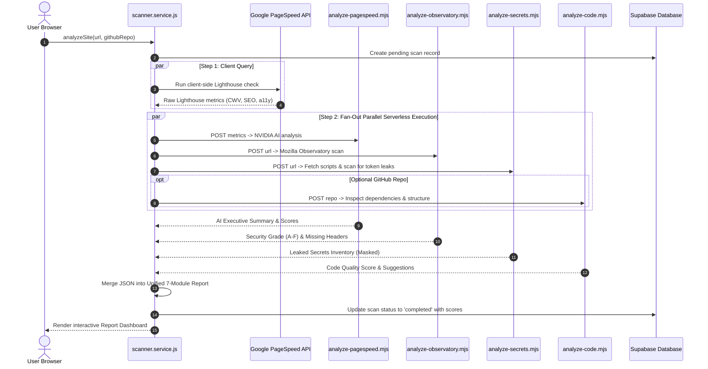

# 🏗️ SiteProof — System & Software Architecture

<div align="center">


**High-Throughput Parallel Audit Pipeline with Serverless AI Orchestration**

[](#)
[-00C7B7?style=for-the-badge&logo=netlify)](#)
[](#)
[](#)

</div>

---

> [!TIP]
> **💡 How to View Visual Markdown in your IDE:**
> Press **`Ctrl + Shift + V`** (or click the **Open Preview to the Side** icon 📖 in the top-right corner of your editor window) to view the rendered images, diagrams, and live preview!
> Below, we have also drawn the visual charts directly in text so they are visible even without preview mode.

---

## 1. 🌐 Visual System Topology Chart

```
┌────────────────────────────────────────────────────────────────────────────────────────┐
│                              CLIENT TIER (BROWSER SPA)                                 │
│                                                                                        │
│   [ ⚛️ React 19 SPA ] ──► [ 🗺️ React Router 7 ] ──► [ 📦 Session / URL Cache ]        │
│          │                                                  │                          │
│          ▼                                                  ▼                          │
│   [ 🎨 Tailwind v4 ]                                 [ 🔐 Supabase Auth Context ]      │
└──────────┬──────────────────────────────────────────────────┬──────────────────────────┘
           │                                                  │
           │  1. Run Public PageSpeed                         │  2. Dispatch Parallel
           ▼                                                  ▼     Serverless Requests
┌───────────────────────────────┐                  ┌─────────────────────────────────────┐
│    GOOGLE PAGESPEED API       │                  │     NETLIFY FUNCTIONS EDGE TIER     │
│                               │                  │                                     │
│  • Largest Contentful Paint   │                  │  ├── analyze-pagespeed.mjs          │
│  • First Input Delay          │                  │  ├── analyze-observatory.mjs        │
│  • Cumulative Layout Shift    │                  │  ├── analyze-secrets.mjs            │
│  • Performance & SEO Scores   │                  │  └── analyze-code.mjs               │
└──────────┬────────────────────┘                  └──────────────┬──────────────────────┘
           │                                                      │
           │  3. Raw Metrics                                      │  4. Secure Server Calls
           ▼                                                      ▼
┌────────────────────────────────────────────────────────────────────────────────────────┐
│                        EXTERNAL DIAGNOSTIC & AI SERVICES                               │
│                                                                                        │
│   [ 🛡️ Mozilla Observatory ]      [ 🔑 Bundle AST Scanner ]    [ 🧠 NVIDIA DeepSeek ]  │
│      • CSP, HSTS, X-Frame            • 25+ Secret Regexes         • Plain English Sum. │
│      • A+ to F Grade Rating          • 6-Char Key Masking         • AI Fix Prompts     │
└────────────────────────────────────────────────────────────────────────────────────────┘
```

---

## 2. ⚡ The "Split-the-Brain" Parallel Pipeline

```
┌────────────────────────────────────────────────────────────────────────────────────────┐
│                        PARALLEL AUDIT TIMELINE (~15 SECONDS TOTAL)                     │
├────────────────────────────────────────────────────────────────────────────────────────┤
│ T=0s  : User inputs URL (e.g., https://my-site.com)                                    │
│ T=1s  : Pending scan logged to Supabase [ sc_12345 ]                                   │
│                                                                                        │
│ T=2s  : PARALLEL DISPATCH (All tasks run at the same time):                            │
│         ├── [Thread 1] Google PageSpeed API check           ────────► [ 4s done ]      │
│         ├── [Thread 2] Mozilla Observatory Security Headers ────────► [ 8s done ]      │
│         ├── [Thread 3] Client JavaScript Secret Leak Scan   ────────► [ 3s done ]      │
│         └── [Thread 4] Optional GitHub Code Inspection      ────────► [ 5s done ]      │
│                                                                                        │
│ T=9s  : Aggregated findings sent to NVIDIA NIM AI (DeepSeek v4)                        │
│ T=14s : Plain-English summary & 1-click Cursor/ChatGPT fix prompts returned            │
│ T=15s : Final 7-Module Interactive Report rendered in Dashboard                        │
└────────────────────────────────────────────────────────────────────────────────────────┘
```



---

## 3. 🗺️ Frontend Route Architecture

The frontend is built with **React 19** and **React Router 7**, employing an auto-recovering lazy-loading mechanism (`lazyWithRetry`) that automatically recovers from stale Vite chunk hashes during rolling deployments:

| Route Path | Component File | Auth State | Purpose |
| :--- | :--- | :--- | :--- |
| `/` | `src/pages/landing/LandingPage.jsx` | Public | High-converting hero, live URL scan bar, value propositions, FAQ |
| `/sample-report` | `src/pages/report/SampleReportPage.jsx` | Public | Instant interactive demo report without needing a live URL |
| `/report/:reportId` | `src/pages/report/ReportPage.jsx` | Public/Auth | Full 7-module audit dashboard, circular gauges, AI prompt copy tool |
| `/dashboard` | `src/pages/dashboard/DashboardPage.jsx` | Protected | User workspace, active monitored sites, recent scores |
| `/history` | `src/pages/history/HistoryPage.jsx` | Protected | Chronological archive of past audits with score trends |
| `/login` | `src/pages/auth/LoginPage.jsx` | Guest | Google OAuth & Email/password login |
| `/signup` | `src/pages/auth/SignupPage.jsx` | Guest | User registration with email verification |
| `/forgot-password` | `src/pages/auth/ForgotPasswordPage.jsx` | Guest | Password reset request form |
| `/reset-password` | `src/pages/auth/ResetPasswordPage.jsx` | Guest | Set new password with Supabase token |
| `/auth/callback` | `src/pages/auth/AuthCallback.jsx` | Public | OAuth exchange handler for Google redirects |
| `/about` | `src/pages/about/AboutPage.jsx` | Public | Product background, philosophy, and team mission |
| `/contact` | `src/pages/contact/ContactPage.jsx` | Public | Support form and inquiry routing |
| `/404` | `src/pages/errors/NotFoundPage.jsx` | Public | Graceful error state with return CTA |

---

## 4. ⚡ Serverless Functions Specification

All sensitive logic, third-party tokens, and AI calls are isolated in `netlify/functions/`:

```
netlify/functions/
├── analyze.mjs              # Main fallback entry point
├── analyze-pagespeed.mjs    # Passes Lighthouse data to NVIDIA DeepSeek AI
├── analyze-observatory.mjs  # Calls Mozilla Observatory API for HTTP security
├── analyze-secrets.mjs      # Fetches client scripts & scans 25+ secret regexes
├── analyze-code.mjs         # Fetches GitHub repo structure & evaluates code
└── utils/
    ├── auth.mjs             # Supabase JWT token verification
    ├── cors.mjs             # CORS origin validation & options handling
    ├── json.mjs             # Robust JSON response sanitization
    ├── ssrf.mjs             # IP / hostname whitelist & SSRF blocking
    └── supabase.mjs         # Serverless Supabase admin client
```

---

## 5. 🗄️ Database & Storage Strategy

> [!NOTE]
> **Minimal Storage Pattern (~300 bytes per scan)**
> To keep Supabase operating comfortably within free tier limits, SiteProof intentionally avoids saving large raw JSON trees or HTML snapshots to the database. Only core metadata (scores, timestamps, domain, user ID) is persisted in the `scans` table. Full diagnostic reports are cached in the browser's session storage and regenerated on-demand.

```
┌─────────────────────────┐       ┌─────────────────────────┐       ┌─────────────────────────┐
│     public.profiles     │       │     public.websites     │       │      public.scans       │
├─────────────────────────┤       ├─────────────────────────┤       ├─────────────────────────┤
│ id (UUID, PK)           │◄──┐   │ id (UUID, PK)           │◄──┐   │ id (UUID, PK)           │
│ name (TEXT)             │   │   │ user_id (UUID, FK) ─────┼───┘   │ user_id (UUID, FK)      │
│ avatar_url (TEXT)       │   └───┼───► website_id (UUID)   │       │ website_id (UUID, FK) ──┼───┐
│ plan (TEXT: free|pro)   │       │ url (TEXT)              │       │ url (TEXT)              │   │
│ scans_this_month (INT)  │       │ domain (TEXT)           │       │ overall_score (INT)     │   │
│ created_at (TIMESTAMPTZ)│       │ last_score (INT)        │       │ security_score (INT)    │   │
│ updated_at (TIMESTAMPTZ)│       │ created_at (TIMESTAMPTZ)│       │ created_at (TIMESTAMPTZ)│   │
└─────────────────────────┘       └─────────────────────────┘       └─────────────────────────┘   │
                                                                                                  │
                                  1 Website has Many Scans (Metadata Only) ───────────────────────┘
```

---

## 6. 🛡️ Security & Defensive Architecture

```
┌────────────────────────────────────────────────────────────────────────────────────────┐
│                              DEFENSIVE SECURITY MODEL                                  │
├───────────────────────────────┬────────────────────────────────────────────────────────┤
│ Inbound URL Guard (SSRF)      │ Blocks localhost, 127.0.0.1, 10.0.0.0/8, 169.254.169. │
│ Serverless Secret Isolation   │ NVIDIA_API_KEY never touches client bundle or git repo.│
│ Secret Token Redaction        │ Client script leaks masked to 6 characters max.        │
│ Error Leakage Prevention      │ 500 responses return clean messages, zero stack traces.│
│ Strict HTTP Security Headers  │ HSTS 2-years, X-Frame-Options DENY, X-Content-Type.    │
└────────────────────────────────────────────────────────────────────────────────────────┘
```
