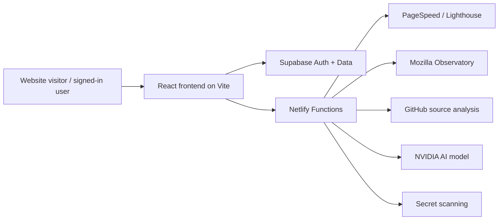

# Architecture Overview

## 1. Purpose
SiteProof is a full-stack SaaS product that audits a website, evaluates quality signals, and generates AI-powered recommendations for remediation. It splits technical concerns between a browser UI, server-side processing, and cloud-managed data/auth services.

## 2. System architecture

## 3. Frontend architecture
### Core stack
- React 19
- Vite
- React Router
- Framer Motion
- Tailwind CSS
- lightweight state and provider pattern for auth, theme, and toast handling

### Frontend responsibilities
- landing page and conversion flow
- scan form and validation UI
- protected route logic for logged-in experiences
- dashboard/report presentation
- historical report review and comparison flows
- client-side UX for loading, error, and success states

### Route model
- `/` — landing page
- `/login`, `/signup`, `/forgot-password`, `/reset-password`, `/verify-email`
- `/auth/callback` — OAuth callback handling
- `/dashboard` — authenticated workspace
- `/history` — user scan history
- `/report/:reportId` — detailed audit report
- `/about`, `/contact`, `/sample-report`
- `/404` — fallback route

## 4. Backend architecture
The backend is implemented with Netlify Functions and is used for all sensitive request handling.

### Main function modules
- `netlify/functions/analyze.mjs` — orchestrator endpoint
- `netlify/functions/analyze-pagespeed.mjs` — Lighthouse/PageSpeed logic
- `netlify/functions/analyze-code.mjs` — repo/code analysis
- `netlify/functions/analyze-observatory.mjs` — security header inspection
- `netlify/functions/analyze-secrets.mjs` — client-side secret leak scanning

### Backend responsibilities
- authenticate requests using Supabase JWT validation
- keep API keys and tokens out of client bundles
- call external analysis services securely
- aggregate scan results into a normalized report format
- preserve structured output for frontend rendering

## 5. Audit pipeline
The scan flow is intentionally parallelized to reduce latency and improve resilience.

### Step 1: Input validation
- sanitize URL input
- validate GitHub repo input when supplied
- check cache before doing fresh work

### Step 2: User/session handling
- if signed in, create or reuse a scan record in Supabase
- attach scan metadata and user context

### Step 3: Parallel external analysis
The service runs multiple tasks concurrently:
- Lighthouse / PageSpeed evaluation
- Mozilla Observatory security checks
- secret scan against extracted client assets
- GitHub-based code inspection when a repo is provided

### Step 4: Merge and normalize results
Results are combined into a richer report with:
- score summary
- issue inventory and severity
- module metadata
- observatory/security details
- AI recommendation output

### Step 5: Store and return
- save report metadata to Supabase when available
- return a cached result when relevant
- display the final report in the app or dashboard

## 6. Data model and persistence
### Supabase responsibilities
- user auth
- secure session handling
- scan record storage
- saved report history
- access control for user-specific data

### Typical reported fields
- url
- githubRepo
- overallScore
- scores
- summary
- riskLevel
- issues
- modules
- observatory
- secretsScan
- aiReport
- timestamps

## 7. Security model
- browser-side code never receives private API keys
- sensitive analysis runs in serverless functions
- auth is validated before protected actions execute
- CORS and request validation are centralized into utility modules
- deployment config includes security headers and hardened static asset rules

## 8. Deployment model
### Local development
- Vite dev server runs locally
- Netlify dev proxies local function calls
- app and backend work together via local configuration

### Production deployment
- frontend is built and deployed to Netlify
- serverless functions run inside the Netlify environment
- environment variables are stored in secure deployment settings

## 9. Architectural strengths
- clean separation of concerns between UI and backend logic
- parallel external service execution reduces analysis time
- secure handling of secrets and AI access
- modular scan engine makes it easier to add new analysis categories
- cache-first behavior improves repeated scan performance

## 10. Architectural risks and constraints
- third-party APIs can rate-limit or fail unpredictably
- automated website scans depend on site accessibility and consistent rendering
- AI recommendations vary based on model behavior and prompt quality
- some repos may be inaccessible or restricted by permissions

## 11. Future architectural evolution
Recommended next steps:
- add team-level workspaces and report sharing
- introduce historical trend analysis and regression tracking
- expand export and reporting workflows
- centralize more issue taxonomy and classification logic
- improve resilience for API errors and partial scan failures

## 12. Implementation decision summary
This architecture aligns with the product’s core needs: speed, reliability, credibility, and secure AI orchestration. It is a strong foundation for a launch-ready customer-facing product and a scalable SaaS roadmap.
