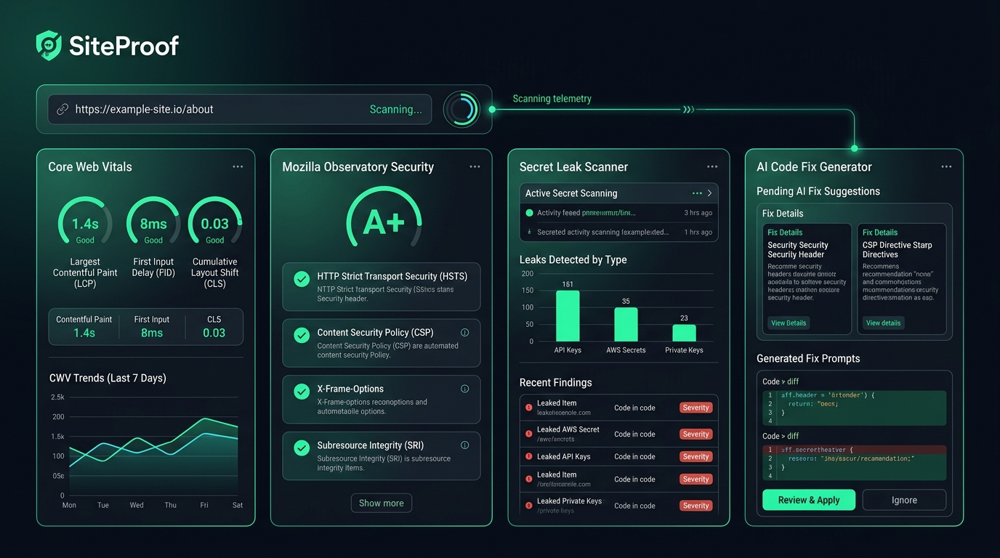

# 🎨 SiteProof — UI/UX Design Direction & Design System

<div align="center">



**The Obsidian & Mint Cyberpunk Aesthetic for High-Trust Web Quality Audits**

[](#)
[](#)
[](#)

</div>

---

> [!TIP]
> **💡 How to View Visual Markdown in your IDE:**
> Press **`Ctrl + Shift + V`** (or click the **Open Preview to the Side** icon 📖 in the top-right corner of your editor window) to view the rendered images, diagrams, and live preview!
> Below, we have also drawn the visual charts directly in text so they are visible even without preview mode.

---

## 1. 🌟 Design Vision & Personality

SiteProof is designed to convey **instant technical authority, speed, and trust**. 
It looks like a high-end security command center, but speaks in simple, friendly, and non-intimidating plain English.

```
┌────────────────────────────────────────────────────────────────────────┐
│                        SITEPROOF VISUAL ESSENCE                        │
├─────────────────────────┬──────────────────────────────────────────────┤
│ 🌌 Dark Obsidian Canvas │ Deep #080C14 base with soft ambient glow     │
│ 🟢 Electric Mint Accent │ #00F5A0 highlights for CTAs & high scores    │
│ 🪟 Glassmorphism Layers │ Subtle translucent card surfaces (#0D1627)   │
│ ⚡ Data Visualization   │ Circular radial progress dials & score chips │
└─────────────────────────┴──────────────────────────────────────────────┘
```

---

## 2. 🎨 Color Token Palette

The entire color system is defined in `src/styles/tokens.css` using Tailwind CSS v4 custom theme tokens:

| Token Name | Hex Code | RGB | Visual Preview | Purpose & Usage |
| :--- | :--- | :--- | :---: | :--- |
| `--color-brand` | `#00F5A0` | `0, 245, 160` | 🟢 | **Primary Accent**: CTAs, active states, circular gauge fills, success |
| `--color-brand-hover` | `#00E093` | `0, 224, 147` | 🟢 | **Button Hover**: Hover state on primary interactive elements |
| `--color-brand-obsidian`| `#080C14` | `8, 12, 20` | ⚫ | **Primary Canvas**: The deep dark background across all views |
| `--color-card-bg` | `#0D1627` | `13, 22, 39` | 🌌 | **Card Surface**: Container cards, elevated modals, data tables |
| `--color-card-border` | `rgba(0, 245, 160, 0.12)`| `0, 245, 160, 0.12` | ❇️ | **Subtle Glow Borders**: Thin 1px borders surrounding card elements |
| `--color-secondary` | `#3B82F6` | `59, 130, 246` | 🔵 | **Tech Accent**: Secondary buttons, links, telemetry lines |
| `--color-warning` | `#F59E0B` | `245, 158, 11` | 🟡 | **Warning**: Moderate severity flags, score tier 50–79 |
| `--color-danger` | `#EF4444` | `239, 68, 68` | 🔴 | **Critical Alert**: Leaked secrets, missing security headers, score < 50 |

---

## 3. ✍️ Typography & Font Hierarchy

SiteProof uses three specialized Google Fonts tailored for modern web applications:

```
┌────────────────────────────────────────────────────────────────────────┐
│ TYPOGRAPHY SCALE                                                       │
├────────────────────────────────────────────────────────────────────────┤
│ Title Headlines  : Outfit / Plus Jakarta Sans (Bold, high impact)      │
│ Body & Subtitles : Plus Jakarta Sans / Inter (Crisp readability)       │
│ Scores & Prompts : JetBrains Mono (Monospace precision, code boxes)    │
└────────────────────────────────────────────────────────────────────────┘
```

---

## 4. 📐 Wireframe Layout Blueprints

### 4.1 Landing Page Architecture (`/`)
```
+-------------------------------------------------------------------------+
| [Logo: 🛡️ SiteProof]         About   Sample Report   Contact    [Log In] |
+-------------------------------------------------------------------------+
|                                                                         |
|                Audit, Secure & Fix Your Website in 15s                 |
|             The Quality & Remediation Engine for AI-Built Sites          |
|                                                                         |
|      +-----------------------------------------------------------+      |
|      | 🔗 https://your-website.com            | [🚀 Run AI Audit] |      |
|      +-----------------------------------------------------------+      |
|              [Or view an interactive instant sample report ->]          |
|                                                                         |
|   [⚡ Core Web Vitals]   [🛡️ Mozilla Security]   [🔑 Secret Detection]  |
|                                                                         |
+-------------------------------------------------------------------------+
```

### 4.2 Report Dashboard Architecture (`/report/:reportId`)
```
+-------------------------------------------------------------------------+
| 🌐 audit: example-site.com            Overall Score: [ 94 / 100 🟢 ]   |
+-------------------------------------------------------------------------+
|  [ ⚡ Performance: 91 ]  [ 🛡️ Security: A+ ]  [ 🔍 SEO: 98 ]  [ ♿ A11y: 95 ]  |
+-------------------------------------------------------------------------+
|                                                                         |
|  📋 AI Plain-English Executive Summary                                  |
|  "Your site loads in 1.2s and has great SEO. However, your CSP header  |
|   is missing and your Google Analytics token was exposed in bundle.js"  |
|                                                                         |
|  🤖 Ready-to-Use AI Fix Prompt (Click to Copy)                          |
|  +-------------------------------------------------------------------+  |
|  | prompt: "Add strict Content-Security-Policy headers in           |  |
|  | netlify.toml and move process.env.GA_TOKEN to serverless..."     |  |
|  |                                                [📋 Copy Prompt]   |  |
|  +-------------------------------------------------------------------+  |
|                                                                         |
|  📂 Detailed Modules:                                                   |
|  - [⚡ Performance Deep Dive]    - [🛡️ Mozilla Observatory Breakdown]   |
|  - [🔐 Secret Leak Analysis]     - [📦 GitHub Repo Inspection]         |
+-------------------------------------------------------------------------+
```

---

## 5. 🧩 Component Anatomy

### 5.1 Circular Score Gauges
* **Radius & Stroke**: SVG circular rings with stroke dash-offset animations driven by Framer Motion.
* **Tier Colors**:
  - `90 – 100`: Mint Green (`#00F5A0`) — Optimal / Production Ready
  - `70 – 89`: Electric Cyan (`#38BDF8`) — Good / Minor Polish Needed
  - `50 – 69`: Amber Gold (`#F59E0B`) — Fair / Noticeable Regressions
  - `0 – 49`: Crimson Red (`#EF4444`) — Critical Fix Required

### 5.2 The AI Fix Prompt Card
* Monospaced code box with syntax highlighting.
* Instant 1-click **"Copy Prompt"** with visual checkmark feedback.
* Targeted tool tags: `Cursor`, `Bolt.new`, `v0`, `Lovable`, `ChatGPT`.
