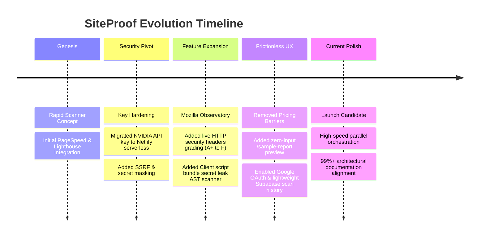

# 🧠 SiteProof — Project Memory & Executive Context

**Core Project Philosophy, Environment Truths, and Architectural Memory**

[-00C7B7?style=for-the-badge)](#)

---

## 1. 📌 Core Identity & Mission

SiteProof was created to solve a major blind spot in the modern AI website creation era: **People are building websites faster than ever with AI tools, but have no way to know if their site is actually safe, fast, and production-ready.**

* **The User Persona**: Non-technical founders, vibe coders, and freelance web builders.
* **The Promise**: "Explain like I'm 5, fix like a Staff Engineer."
* **The Bridge**: Diagnostics shouldn't just be numbers—they must be paired with **copyable AI prompts** that feed directly back into Cursor, Bolt.new, Lovable, v0, or ChatGPT to execute the fix instantly.

---

## 2. 📜 Evolution History & Key Decisions

1. **Removal of Pricing Friction**: Early iterations considered pricing gates, but the user chose to remove the pricing section for launch to focus entirely on virality, user adoption, and trust.
2. **Interactive Sample Report (`/sample-report`)**: Built specifically so visitors without a live site or API setup can immediately test and experience the full audit report.
3. **Mozilla Observatory Integration**: Added to provide authoritative security header grading (CSP, HSTS, X-Frame-Options) alongside performance scores.
4. **Lightweight Supabase Storage**: Rather than storing multi-megabyte raw HTML scrapes or Lighthouse JSON blobs in Postgres, only lightweight metadata (~300 bytes) is saved. Full reports are dynamically compiled and cached client-side.

---

## 3. 🔑 Environment Variables Matrix

| Variable | Target Scope | Public or Secret | Purpose |
| :--- | :--- | :---: | :--- |
| `VITE_SUPABASE_URL` | Client (`.env`) | 🌐 Public | Supabase project API gateway |
| `VITE_SUPABASE_ANON_KEY` | Client (`.env`) | 🌐 Public | Client-side Supabase anonymous key (RLS enforced) |
| `VITE_PAGESPEED_API_KEY` | Client (`.env`) | 🌐 Public | Google PageSpeed Insights API key |
| `VITE_GOOGLE_CLIENT_ID` | Client (`.env`) | 🌐 Public | Google OAuth login Client ID |
| `VITE_GOOGLE_REDIRECT_URI` | Client (`.env`) | 🌐 Public | OAuth redirect URL (`/auth/callback`) |
| `NVIDIA_API_KEY` | Netlify Dashboard | 🔒 **STRICT SECRET** | NVIDIA NIM DeepSeek AI key (serverless only) |
| `NVIDIA_MODEL` | Netlify Dashboard | ⚙️ Config | AI model identifier (e.g. `deepseek-ai/...`) |
| `GITHUB_TOKEN` | Netlify Dashboard | 🔒 Secret | Optional token for higher GitHub REST API rate limits |

---

## 4. 🧭 Key Files Map

* [`src/App.jsx`](file:///c:/Users/Lenovo/Documents/vibe%20codding/src/App.jsx) — Root router with `lazyWithRetry` route chunk recovery.
* [`src/pages/landing/LandingPage.jsx`](file:///c:/Users/Lenovo/Documents/vibe%20codding/src/pages/landing/LandingPage.jsx) — Primary conversion homepage with live scan input.
* [`src/pages/report/ReportPage.jsx`](file:///c:/Users/Lenovo/Documents/vibe%20codding/src/pages/report/ReportPage.jsx) — Comprehensive 7-module audit report dashboard.
* [`src/pages/report/SampleReportPage.jsx`](file:///c:/Users/Lenovo/Documents/vibe%20codding/src/pages/report/SampleReportPage.jsx) — Frictionless demo report for new visitors.
* [`src/services/scanner.service.js`](file:///c:/Users/Lenovo/Documents/vibe%20codding/src/services/scanner.service.js) — The core parallel scan coordinator.
* [`netlify/functions/`](file:///c:/Users/Lenovo/Documents/vibe%20codding/netlify/functions/) — Serverless functions powering AI and external APIs securely.
* [`database/supabase_migration.sql`](file:///c:/Users/Lenovo/Documents/vibe%20codding/database/supabase_migration.sql) — Supabase RLS policies and table structures.
* [`netlify.toml`](file:///c:/Users/Lenovo/Documents/vibe%20codding/netlify.toml) — Production build commands, caching, and security headers.

---

## 5. 🤖 Automated Assistant Directive

* **Target Experience**: The user is a visionary founder without deep terminal or coding background. Always handle Git commits and deployment builds automatically.
* **Deploy Rule**: Always deploy `dist` to Netlify, never the project root.
* **Security Rule**: Never leak private API keys in client-facing code or git repositories.
