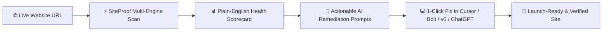
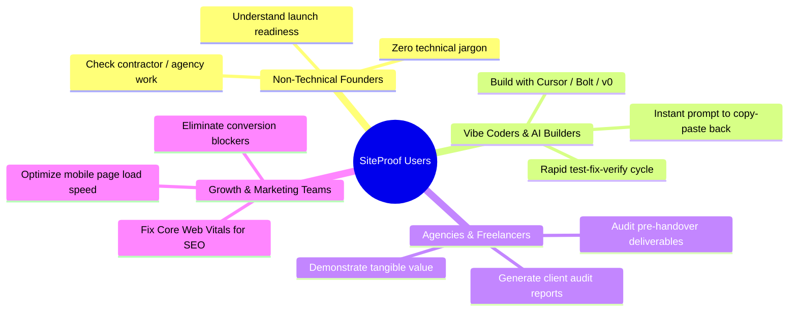
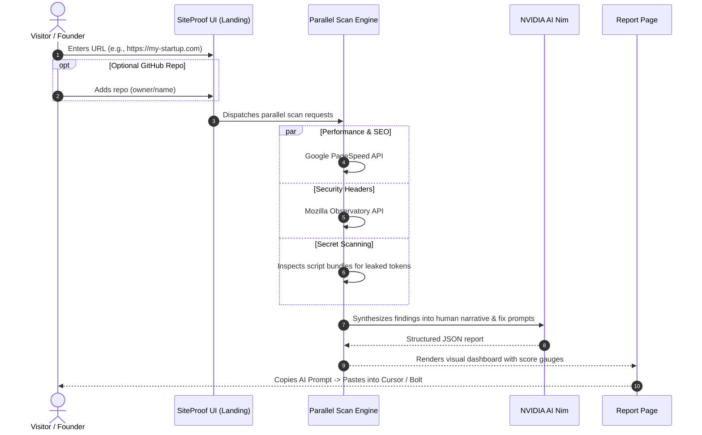
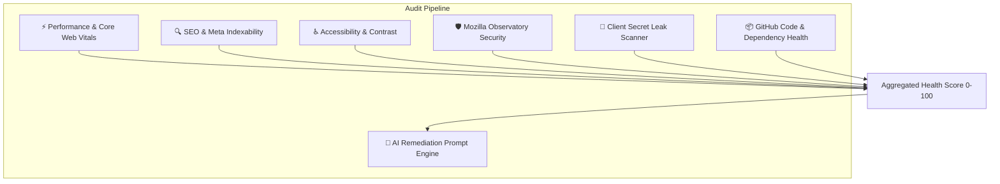

# 🛡️ SiteProof — Product Requirements Document (PRD)

**The Trust Layer & Quality Remediation Engine for AI-Built Websites**

---

## 1. 🎯 Product Vision & Core Mission

> [!IMPORTANT]
> **Core Philosophy: "Explain like I'm 5, Fix like a Staff Engineer."**
> Rapid website builders, vibe coders, and non-technical founders often build websites without knowing whether their code leaks API secrets, violates security policies, or lags on mobile devices. SiteProof translates complex technical diagnostic data into **plain English insights** and **direct AI prompt fixes** you can copy-paste straight into tools like Cursor, Bolt, Lovable, v0, or ChatGPT.

---

## 2. 🧩 The Problems We Solve

AI website generators and low-code platforms allow anyone to spin up a web app in minutes. However, they frequently suffer from silent, critical vulnerabilities:

| Category | Problem in AI-Generated Sites | How SiteProof Solves It |
| :--- | :--- | :--- |
| ⚡ **Performance** | Bloated bundles, unoptimized media, failing Core Web Vitals (LCP, CLS, FID) | Real-time PageSpeed Insights telemetry with exact asset optimization cues |
| 🔒 **Security Headers** | Missing CSP, HSTS, X-Frame-Options (vulnerable to clickjacking & XSS) | Live Mozilla Observatory scan with letter grades and header configurations |
| 🔑 **Secret Leaks** | Hardcoded API keys, Supabase service roles, AWS credentials in client JS | Regex-based client-bundle AST scanner with strict key masking |
| 🔍 **SEO & Discoverability** | Broken meta tags, missing canonical URLs, unindexed SPAs | Technical SEO inspection checking robot tags, OpenGraph, and semantic tags |
| 🧑‍💻 **Remediation Gap** | Users don't know what cryptic errors mean or how to write code to fix them | Generates structured code prompts with file context ready for AI code editors |
| 🧪 **Demo Friction** | Non-technical users hesitate to test their live site or lack credentials | Zero-barrier interactive **Sample Report (`/sample-report`)** preview |

---

## 3. 👥 Target Personas

---

## 4. 🧭 Core User Journeys

### Journey A: Instant One-Click Audit (Zero Friction)

### Journey B: Interactive Sample Report (No Website Needed)
For visitors who don't yet have a live URL or want to explore SiteProof's capabilities before running a scan:
1. User clicks **"View Sample Report"** on the landing page or navigates to [`/sample-report`](file:///c:/Users/Lenovo/Documents/vibe%20codding/src/pages/report/SampleReportPage.jsx).
2. The UI instantly loads an audited report demonstrating realistic scores, identified security vulnerabilities, and generated prompt solutions.
3. User explores the module cards, toggles severity filters, and tests the "Copy Prompt" button.

### Journey C: Authenticated History & Trend Tracking
1. User signs in with **Google OAuth** or email password via Supabase.
2. Every scan performed is linked to their profile in the [`scans`](file:///c:/Users/Lenovo/Documents/vibe%20codding/database/supabase_migration.sql) table.
3. User visits [`/dashboard`](file:///c:/Users/Lenovo/Documents/vibe%20codding/src/pages/dashboard/DashboardPage.jsx) or [`/history`](file:///c:/Users/Lenovo/Documents/vibe%20codding/src/pages/history/HistoryPage.jsx) to re-open past reports, track score improvements, and manage multiple domains.

---

## 5. ⚙️ Functional Specifications

### 5.1 Scanning Modules
SiteProof organizes all diagnostic checks into 7 cohesive modules:

* **Module 1: Performance**: LCP (Largest Contentful Paint), FID (First Input Delay), CLS (Cumulative Layout Shift), Total Blocking Time, bundle payloads.
* **Module 2: SEO**: Meta title, description, viewport tag, robot indexing directives, OpenGraph tags, canonical URLs.
* **Module 3: Accessibility**: Color contrast ratios, missing alt attributes on images, ARIA landmark roles, semantic heading structures.
* **Module 4: Security Headers (Mozilla Observatory)**: Real-time scan measuring CSP (Content Security Policy), HSTS, X-Frame-Options, X-Content-Type-Options, Referrer-Policy.
* **Module 5: Secret Scanner**: Extracts client script tags and evaluates against 25+ regex patterns (OpenAI, Supabase Service Keys, Stripe, GitHub PAT, AWS Access Keys). Masks leaked values to first 6 characters to prevent exposure.
* **Module 6: GitHub Code Inspection**: Optional deep check analyzing `package.json`, dependency vulnerabilities, outdated libraries, and project structure.
* **Module 7: NVIDIA AI Remediation Engine**: Feeds normalized issues into deep learning models (NVIDIA NIM / DeepSeek) to output:
  - Executive summary in plain English.
  - Priority-ordered fix recommendations.
  - Ready-to-use AI prompts specifying the exact files and lines to modify.

---

## 6. 🔐 Security & Privacy Specifications

> [!CAUTION]
> **Client-Side Safety Rules**
> - **Zero Key Exposure**: `NVIDIA_API_KEY` and Supabase Service Role keys are strictly kept on the server inside Netlify serverless functions.
> - **SSRF Protection**: URL inputs are sanitized and restricted against loopback (`127.0.0.1`), link-local (`169.254.169.254`), and internal network addresses.
> - **Secret Redaction**: When client secret leaks are detected, only the first 6 characters are rendered with the remainder masked (`ghp_123456••••••••`).
> - **Lightweight Database footprint**: Supabase only stores lightweight scan metadata (~300 bytes) without persisting full raw page scrapes, protecting user confidentiality and database free tier storage.

---

## 7. 🚀 Launch Criteria & Acceptance Matrix

- [x] **Instant Scan**: Public website URL can be audited within 15–30 seconds.
- [x] **Plain English Translation**: All warnings include a "Why this matters" explanation without developer jargon.
- [x] **Copy-Paste Fix Prompts**: Users can click "Copy Prompt" and paste directly into Cursor or ChatGPT.
- [x] **Demo Experience**: [`/sample-report`](file:///c:/Users/Lenovo/Documents/vibe%20codding/src/pages/report/SampleReportPage.jsx) allows visitors to inspect an interactive audit report immediately.
- [x] **Supabase Authentication**: Users can log in with Google OAuth or Email and view scan history on [`/history`](file:///c:/Users/Lenovo/Documents/vibe%20codding/src/pages/history/HistoryPage.jsx).
- [x] **Dark Obsidian Aesthetic**: High-end cyberpunk/SaaS aesthetic using `#080C14` and `#00F5A0` accents.
