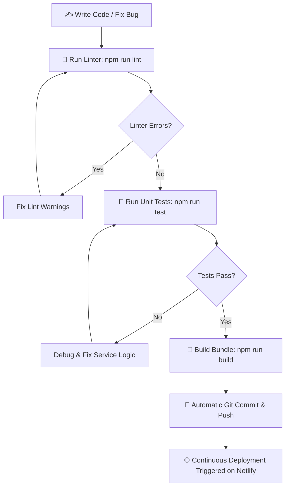
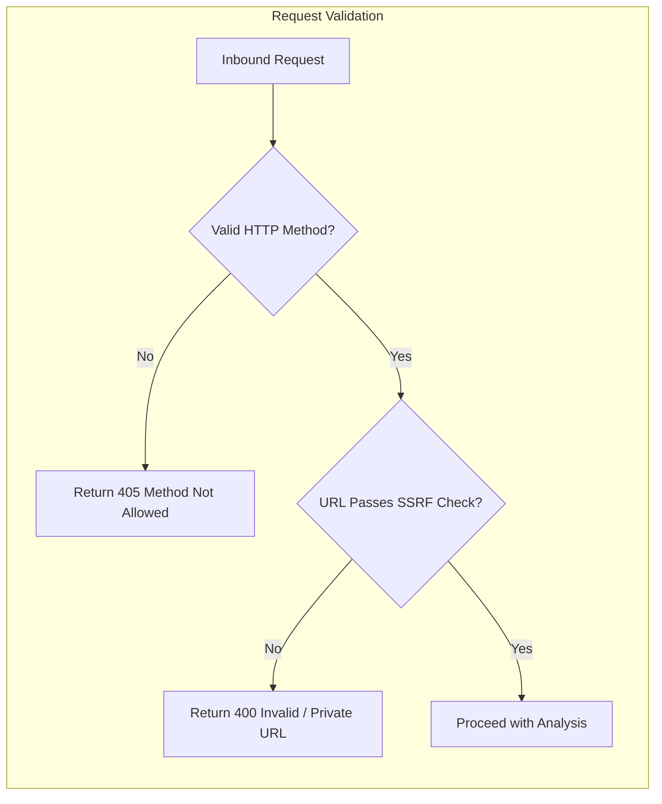

# 📜 SiteProof — Coding Rules & Engineering Standards

<div align="center">

**Core Engineering Guidelines, Deployment Rules, and Non-Negotiable Standards**

[](#)
[](#)
[](#)

</div>

---

## 1. 🚨 Non-Negotiable Project Rules

> [!CAUTION]
> ### 1. Netlify Deployments: ALWAYS Use the `dist` Folder
> - **NEVER** deploy the root directory to Netlify or production hosts. Serving the root serves uncompiled `.jsx` source files, which breaks the live app.
> - **ALWAYS** compile the application locally first via `npm run build`, and deploy the resulting [`dist`](file:///c:/Users/Lenovo/Documents/vibe%20codding/dist) directory.
>
> ### 2. Automated Git Push & No-Tech Friction
> - The repository owner prefers an automated workflow without technical barriers.
> - Whenever code changes are finalized, automatically commit and push them to GitHub (`git add .`, `git commit -m "..."`, `git push`) without blocking the user for manual terminal execution.
>
> ### 3. Absolute Secret Security
> - **NEVER** commit `.env` files or hardcode API keys (e.g. `NVIDIA_API_KEY`, Supabase Service Role Keys) into frontend code or public repositories.
> - All private keys must remain strictly in Netlify Dashboard Environment Variables.

---

## 2. 🔄 Development & Verification Workflow



---

## 3. 📂 Repository Directory Layout

Every file must be placed in its proper architectural domain:

```
vibe codding/
├── .agents/                    # Agent instructions & skills
├── database/                   # Supabase migration scripts
│   └── supabase_migration.sql  # SQL schema (profiles, websites, scans)
├── docs/                       # Project documentation & visual assets
│   └── assets/                 # Architecture & UI diagrams
├── netlify/                    # Serverless Edge Tier
│   └── functions/              # Node/ESM serverless functions
│       └── utils/              # SSRF filters, JWT auth, CORS helpers
├── public/                     # Static public assets (favicons, icons)
├── src/                        # Client-Side Application
│   ├── components/             # Reusable UI components
│   │   ├── auth/               # Login, Signup, Protected Route guards
│   │   ├── common/             # Loading screens, Error boundaries
│   │   ├── landing/            # Hero, Feature cards, FAQ accordion
│   │   ├── layout/             # Navbar, Footer
│   │   ├── scanner/            # URL input bar, scan progress gauges
│   │   └── ui/                 # Buttons, Cards, Badges, Modals
│   ├── config/                 # Supabase client initialization
│   ├── contexts/               # React Contexts (Auth, Theme, Toast)
│   ├── pages/                  # Route-level screens (Landing, Report, etc.)
│   ├── services/               # API clients & audit pipeline logic
│   ├── styles/                 # Tailwind CSS v4 tokens & components
│   └── utils/                  # Formatters, URL validators, scoring math
├── netlify.toml                # Netlify redirects, headers, build commands
├── package.json                # Dependencies & scripts
└── vite.config.js              # Vite bundler & Vitest test setup
```

---

## 4. ⚛️ Frontend Standards (React 19 & Tailwind v4)

* **Component Structure**:
  - Use modern functional components with hooks (`useState`, `useMemo`, `useCallback`, `useEffect`).
  - Avoid bloated single-file monoliths. Extract sub-cards into focused components.
* **Route Code Splitting**:
  - All pages in [`src/App.jsx`](file:///c:/Users/Lenovo/Documents/vibe%20codding/src/App.jsx) must be wrapped with `lazyWithRetry` to prevent chunk loading failures when a user keeps an old tab open across new deployments.
* **Accessibility**:
  - Keep the accessible skip-to-content link intact at the top of [`App.jsx`](file:///c:/Users/Lenovo/Documents/vibe%20codding/src/App.jsx#L64-L69).
  - Provide `aria-label` attributes on all icon-only buttons.
  - Maintain color contrast ratios exceeding 4.5:1 against the `#080C14` dark background.

---

## 5. 🛡️ Serverless & Security Standards



1. **SSRF Guard**: Always pass external target URLs through [`isSafeUrl`](file:///c:/Users/Lenovo/Documents/vibe%20codding/netlify/functions/utils/ssrf.mjs) before dispatching HTTP requests. Never allow connections to `localhost`, `127.0.0.1`, or cloud metadata endpoints (`169.254.169.254`).
2. **Safe Error Handling**: Serverless functions must **never** return raw error stack traces or `err.message` in 500 error payloads. Log full details securely on the server using `console.error`, and return a clean, friendly message to the client.
3. **Secret Masking**: When client script scans identify an exposed key, redact all but the first 6 characters (`ghp_1a2b3c••••••••`).

---

## 6. 🧼 Quality & Review Checklist

Before finalizing any changes to the codebase, verify:

- [ ] **Build Check**: Does `npm run build` succeed with zero errors?
- [ ] **Lint Check**: Does `npm run lint` report zero errors?
- [ ] **No Secret Commits**: Are there any credentials or `.env` files staged in git?
- [ ] **User Experience**: Is the user journey intuitive, fast, and translated into plain English?
- [ ] **Dark-Mode Visual Fidelity**: Are brand colors (`#00F5A0`, `#080C14`) and card styles preserved?
