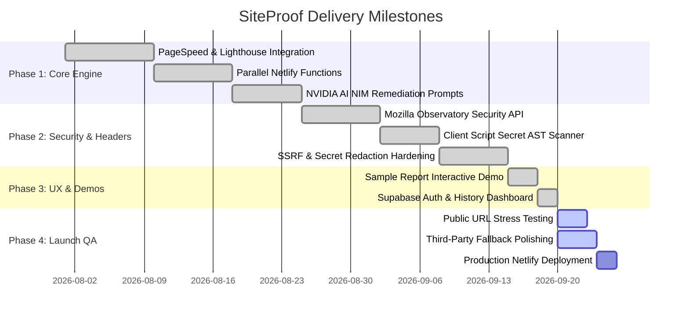

# 📋 SiteProof — Tasks, Roadmap & Launch Readiness

**Development Progress, Launch Readiness Checklist & Feature Roadmap**

---

## 1. 📊 Project Phase Progress

---

## 2. 🟢 Completed Deliverables

| Area | Feature | Status | Implementation File |
| :--- | :--- | :---: | :--- |
| **Audit Engine** | Google PageSpeed & Core Web Vitals telemetry | 🟢 Complete | [`lighthouse.service.js`](file:///c:/Users/Lenovo/Documents/vibe%20codding/src/services/lighthouse.service.js) |
| **Security** | Live Mozilla Observatory HTTP headers audit | 🟢 Complete | [`analyze-observatory.mjs`](file:///c:/Users/Lenovo/Documents/vibe%20codding/netlify/functions/analyze-observatory.mjs) |
| **Security** | Client JavaScript bundle secret token scanner | 🟢 Complete | [`analyze-secrets.mjs`](file:///c:/Users/Lenovo/Documents/vibe%20codding/netlify/functions/analyze-secrets.mjs) |
| **Security** | SSRF prevention filter & key masking | 🟢 Complete | [`ssrf.mjs`](file:///c:/Users/Lenovo/Documents/vibe%20codding/netlify/functions/utils/ssrf.mjs) |
| **AI Layer** | NVIDIA DeepSeek plain-English summaries & fix prompts | 🟢 Complete | [`analyze-pagespeed.mjs`](file:///c:/Users/Lenovo/Documents/vibe%20codding/netlify/functions/analyze-pagespeed.mjs) |
| **Demo Flow** | Interactive Sample Report for immediate preview | 🟢 Complete | [`SampleReportPage.jsx`](file:///c:/Users/Lenovo/Documents/vibe%20codding/src/pages/report/SampleReportPage.jsx) |
| **Auth** | Supabase Google OAuth & Email/Password login | 🟢 Complete | [`AuthContext.jsx`](file:///c:/Users/Lenovo/Documents/vibe%20codding/src/contexts/AuthContext.jsx) |
| **History** | User audit archives & lightweight scan storage | 🟢 Complete | [`HistoryPage.jsx`](file:///c:/Users/Lenovo/Documents/vibe%20codding/src/pages/history/HistoryPage.jsx) |
| **Design** | Obsidian & Mint dark visual design system | 🟢 Complete | [`tokens.css`](file:///c:/Users/Lenovo/Documents/vibe%20codding/src/styles/tokens.css) |
| **Hardening** | Netlify HSTS, X-Frame-Options, CSP, cache headers | 🟢 Complete | [`netlify.toml`](file:///c:/Users/Lenovo/Documents/vibe%20codding/netlify.toml) |

---

## 3. 🟡 Active Tasks (Immediate Focus)

- [ ] **Real-World URL Stress Testing**: Run end-to-end audits on 10+ diverse public websites (Next.js SPAs, Shopify stores, WordPress, static blogs) to verify score consistency.
- [ ] **External API Fallback Grace**: Ensure that if Mozilla Observatory or PageSpeed API rate-limits temporarily, the scan still returns all other modules cleanly without breaking the report view.
- [ ] **Linter & Warning Clean-Up**: Clear the 3 minor React hook dependency warnings identified in [`ReportPage.jsx`](file:///c:/Users/Lenovo/Documents/vibe%20codding/src/pages/report/ReportPage.jsx) and [`AuthContext.jsx`](file:///c:/Users/Lenovo/Documents/vibe%20codding/src/contexts/AuthContext.jsx).

---

## 4. 🔵 Upcoming Roadmap & Feature Backlog

- [ ] **1-Click PDF Report Export**: Client-side styled PDF generation so agencies can download and send branded audit reports directly to clients.
- [ ] **Scheduled Recurring Site Monitoring**: Background cron jobs checking a user's website weekly and emailing alerts if security headers or Core Web Vitals degrade.
- [ ] **Multi-Page Crawling**: Option to scan up to 5 sub-pages (e.g. `/`, `/pricing`, `/checkout`) instead of just the root URL.
- [ ] **Team Workspaces**: Allow team members to share an organization dashboard and collaborate on remediation tasks.

---

## 5. 🚀 Launch Readiness Checklist

- [x] Responsive layout tested on desktop, tablet, and mobile.
- [x] Zero private keys present in client bundle (`dist`).
- [x] Netlify functions respond in under 20s via parallel orchestration.
- [x] Interactive sample report functions without login or URL input.
- [x] Supabase Row Level Security (RLS) properly isolates user scans.
- [ ] Final live production smoke test on Netlify custom domain.
