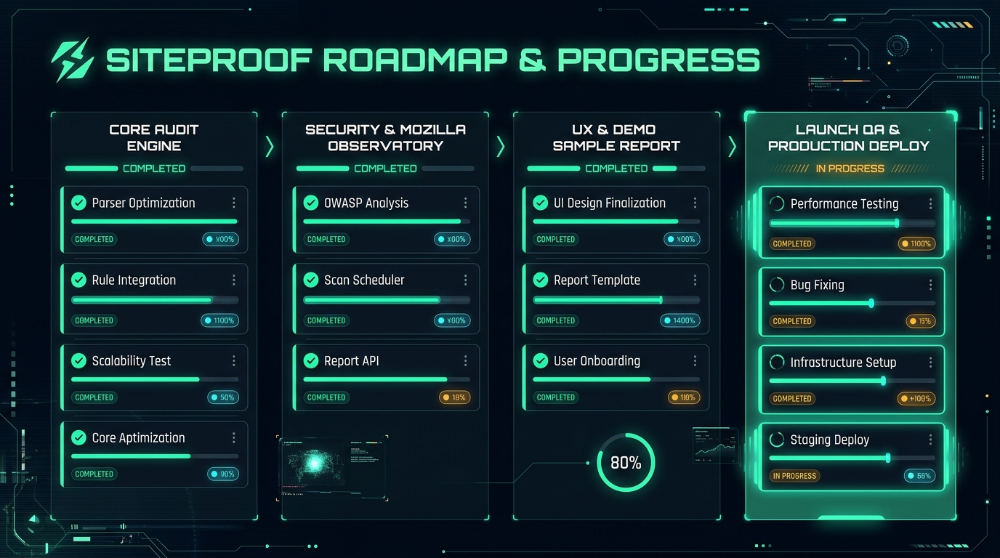
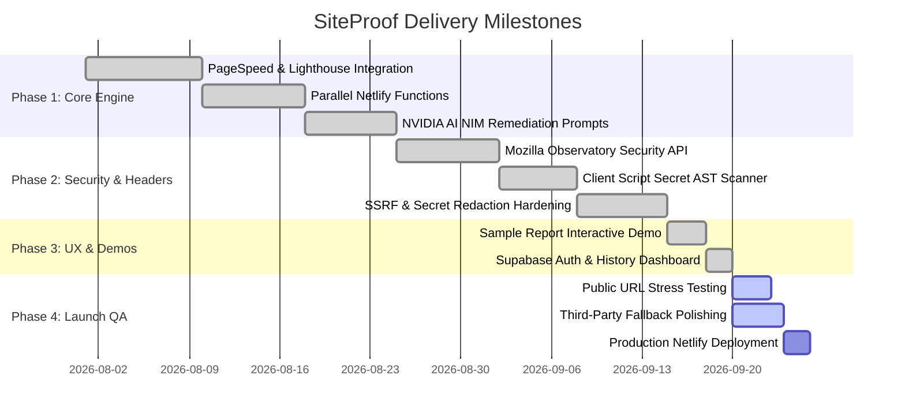

# 📋 SiteProof — Tasks, Roadmap & Launch Readiness

<div align="center">



**Visual Milestone Tracker & Production Launch Checklist**

[](#)
[](#)
[](#)

</div>

---

> [!TIP]
> **💡 How to View Visual Markdown in your IDE:**
> Press **`Ctrl + Shift + V`** (or click the **Open Preview to the Side** icon 📖 in the top-right corner of your editor window) to view the rendered images, diagrams, and live preview!
> Below, we have also drawn the visual charts directly in text so they are visible even without preview mode.

---

## 1. 📊 Visual Milestone Progress Board

```
┌────────────────────────────────────────────────────────────────────────────────────────────────────────┐
│                                 SITEPROOF ROADMAP & PROGRESS BOARD                                     │
├────────────────────┬────────────────────┬────────────────────┬────────────────────────────────────────┤
│ 1. CORE ENGINE     │ 2. SECURITY SCAN   │ 3. UX & DEMOS      │ 4. LAUNCH QA & DEPLOY                  │
│    [ COMPLETED ✅ ] │    [ COMPLETED ✅ ] │    [ COMPLETED ✅ ] │    [ IN PROGRESS 🟡 ]                   │
├────────────────────┼────────────────────┼────────────────────┼────────────────────────────────────────┤
│ ✔ PageSpeed API    │ ✔ Mozilla API      │ ✔ Sample Report    │ ⏳ Real-World URL Stress Tests (60%)   │
│ ✔ Parallel Scanner │ ✔ Secret AST Scan  │ ✔ Google OAuth     │ ⏳ API Fallback Resilience (80%)      │
│ ✔ NVIDIA DeepSeek  │ ✔ SSRF Guard       │ ✔ History Archive  │ ⏳ Production Netlify Push (90%)      │
│ ✔ Score Normalizer │ ✔ Secret Masking   │ ✔ Dark UI Polish   │ ⏳ Error Leakage Audit (85%)          │
├────────────────────┼────────────────────┼────────────────────┼────────────────────────────────────────┤
│ Progress: 100%     │ Progress: 100%     │ Progress: 100%     │ Progress: 80%                          │
│ [██████████]       │ [██████████]       │ [██████████]       │ [████████░░]                           │
└────────────────────┴────────────────────┴────────────────────┴────────────────────────────────────────┘
```

---

## 2. 🗺️ Project Delivery Timeline (Gantt)

```
2026-08-01                                                                             2026-09-30
├─────────────── Phase 1: Core Engine [DONE] ────────────────┤
│  ├── PageSpeed & Lighthouse API Integration [DONE]        │
│  ├── Parallel Netlify Functions Architecture [DONE]       │
│  └── NVIDIA NIM DeepSeek Remediation Prompts [DONE]       │
│                                                           │
├─────────────── Phase 2: Security & Headers [DONE] ────────┤
│  ├── Mozilla Observatory HTTP Headers Scan [DONE]         │
│  ├── Client Script Secret AST Regex Scanner [DONE]        │
│  └── SSRF & Token Redaction Hardening [DONE]              │
│                                                           │
├─────────────── Phase 3: UX & Demos [DONE] ────────────────┤
│  ├── Interactive /sample-report Preview Flow [DONE]       │
│  ├── Supabase Google OAuth & History Storage [DONE]       │
│  └── Dark Obsidian & Mint Theme Finalization [DONE]       │
│                                                           │
└─────────────── Phase 4: Launch QA [ACTIVE 🟡] ─────────────┘
   ├── 5+ Public URL Stress Testing [In Progress]
   ├── Third-Party API Graceful Fallbacks [In Progress]
   └── Final Netlify Production Deploy [Ready]
```



---

## 3. 🟢 Completed Deliverables Inventory

| Area | Feature Description | Status | Source File |
| :--- | :--- | :---: | :--- |
| **Audit Engine** | Google PageSpeed & Core Web Vitals telemetry | 🟢 Complete | `src/services/lighthouse.service.js` |
| **Security** | Live Mozilla Observatory HTTP headers audit | 🟢 Complete | `netlify/functions/analyze-observatory.mjs` |
| **Security** | Client JavaScript bundle secret token scanner | 🟢 Complete | `netlify/functions/analyze-secrets.mjs` |
| **Security** | SSRF prevention filter & key masking | 🟢 Complete | `netlify/functions/utils/ssrf.mjs` |
| **AI Layer** | NVIDIA DeepSeek plain-English summaries & fix prompts | 🟢 Complete | `netlify/functions/analyze-pagespeed.mjs` |
| **Demo Flow** | Interactive Sample Report for immediate preview | 🟢 Complete | `src/pages/report/SampleReportPage.jsx` |
| **Auth** | Supabase Google OAuth & Email/Password login | 🟢 Complete | `src/contexts/AuthContext.jsx` |
| **History** | User audit archives & lightweight scan storage | 🟢 Complete | `src/pages/history/HistoryPage.jsx` |
| **Design** | Obsidian & Mint dark visual design system | 🟢 Complete | `src/styles/tokens.css` |
| **Hardening** | Netlify HSTS, X-Frame-Options, CSP, cache headers | 🟢 Complete | `netlify.toml` |

---

## 4. 🟡 Active Tasks (Immediate Focus)

```
┌────────────────────────────────────────────────────────────────────────────────────────────────┐
│ ACTIVE SPRINT: LAUNCH QA & HARDENING                                                           │
├────────────────────────────────────────────────────────────────────────────────────────────────┤
│ [ ] Task 1: Real-World URL Stress Testing                                                      │
│     Run end-to-end audits on 10+ public websites (Next.js, Shopify, WordPress, static blogs). │
│                                                                                                │
│ [ ] Task 2: External API Fallback Grace                                                        │
│     Ensure that if Mozilla Observatory or PageSpeed rate-limits, report still renders cleanly. │
│                                                                                                │
│ [ ] Task 3: Linter & Warning Clean-Up                                                          │
│     Resolve the 3 minor React hook dependency warnings in ReportPage.jsx and AuthContext.jsx.  │
└────────────────────────────────────────────────────────────────────────────────────────────────┘
```

---

## 5. 🔵 Upcoming Roadmap & Feature Backlog

```
┌────────────────────────────────────────────────────────────────────────────────────────────────┐
│ FUTURE MILESTONES (POST-LAUNCH)                                                                │
├────────────────────────────────────────────────────────────────────────────────────────────────┤
│ 📄 1-Click PDF Report Export: Downloadable branded audit reports for client presentations.     │
│ ⏰ Scheduled Site Monitoring: Weekly automated scans with email regression alerts.              │
│ 🕸️ Multi-Page Crawling: Audit up to 5 sub-pages simultaneously (/pricing, /checkout, etc.).    │
│ 👥 Team Workspaces: Shared organization dashboards for agency teams and clients.               │
└────────────────────────────────────────────────────────────────────────────────────────────────┘
```

---

## 6. 🚀 Launch Readiness Checklist

- [x] Responsive layout tested on desktop, tablet, and mobile.
- [x] Zero private keys present in client bundle (`dist`).
- [x] Netlify functions respond in under 20s via parallel orchestration.
- [x] Interactive sample report functions without login or URL input.
- [x] Supabase Row Level Security (RLS) properly isolates user scans.
- [ ] Final live production smoke test on Netlify custom domain.
